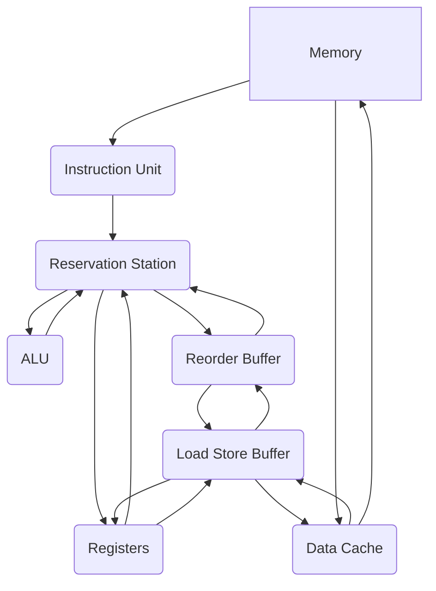

## Diagram

#### Instruction Unit

The instruction unit is responsible for organizing instructions to be fetched from memory. It fetches the instruction at current PC and then issues it to the execution unit.

#### Reservation unit

The reservation unit records instructions as well as the operands of each instruction. It checks if the operands are available and if execution unit is free before starting execution.

#### ALU

The arithmetic logic unit (ALU) calculates based on the incoming operands and operation codes.

#### Reorder Buffer

The reorder buffer records the order of instructions and guarantees to commit them in sequence by continuously checking if the first instruction is ready to commit.

#### Load Store Buffer

The load store buffer commits changes to data cache and reports to the reorder buffer.

#### Data Cache

The data cache stores data to accelerate data access.
